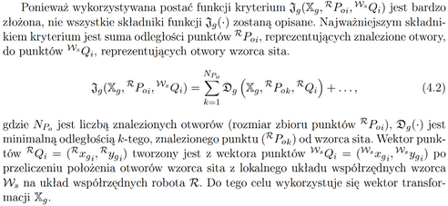
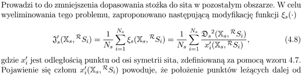
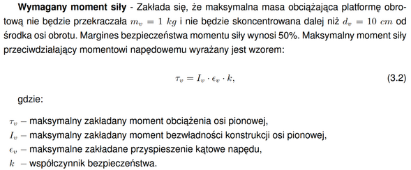

# Wytyczne dotyczące realizacji prac inżynierskich i magisterskich

Niniejszy dokument porządkuje podstawowe wymagania organizacyjne oraz najważniejsze zalecenia związane z przygotowaniem pracy dyplomowej.  
Ma on charakter ogólny i może stanowić punkt odniesienia zarówno na etapie planowania pracy, jak i podczas jej późniejszej realizacji.

## 1. Zakres oczekiwań po 6./2. semestrze

Po zakończeniu 6./2. semestru student powinien dysponować przynajmniej wstępnym szkicem pracy oraz udokumentowanym stanem zaawansowania projektu.

W szczególności oczekuje się przygotowania następujących elementów:

- spisu treści,
- wstępu,
- krótkiej informacji o postępach prac.

Informacja o postępach nie musi mieć rozbudowanej formy.  
Wystarczający jest zwięzły opis aktualnego etapu realizacji projektu, ze wskazaniem, które elementy zostały już wykonane, a które pozostają na dalszym etapie opracowania.

## 2. Zasady przygotowywania tekstu pracy

Szczegółowe zagadnienia związane z redakcją pracy dyplomowej są zazwyczaj omawiane w trakcie seminarium, jednak już na etapie przygotowań warto stosować podstawowe zasady poprawnego warsztatu akademickiego.

Tekst pracy powinien być:

- samodzielnie opracowany,
- spójny logicznie i terminologicznie,
- osadzony w kontekście całego projektu,
- oparty na poprawnie dobranych źródłach,
- przygotowany zgodnie z zasadami cytowania i odwołań.

Każdy fragment pracy powinien pełnić określoną funkcję merytoryczną.  
Należy unikać nadmiernego rozbudowywania opisów, powtarzania tych samych informacji oraz wprowadzania treści, które nie wnoszą istotnej wartości do wywodu.

## 3. Korzystanie z narzędzi AI

> **Student ponosi pełną odpowiedzialność za poprawność merytoryczną tekstu, niezależnie od użytych narzędzi.**

Domyślnie zakłada się samodzielną redakcję treści pracy, przy minimalnym poziomie lub bez użycia narzędzi sztucznej inteligencji.  
W przypadku planowanego wykorzystania narzędzi sztucznej inteligencji należy skontaktować się z opiekunem pracy w celu ustalenia dopuszczalnego zakresu ich stosowania. Podejście poszczególnych opiekunów może się znacząco różnić, dlatego indywidualne ustalenia są konieczne.

Generowanie pełnych zdań lub akapitów bezpośrednio za pomocą narzędzi AI jest niedopuszczalne.  
W pewnym zakresie możliwe jest natomiast wykorzystanie tych narzędzi jako wsparcia w pracy nad tekstem. Ich użycie powinno mieć charakter pomocniczy i nie może zastępować samodzielnego opracowania treści.

W przypadku korzystania z narzędzi AI należy:

- zachować pełną kontrolę nad merytoryczną zawartością tekstu,
- zweryfikować poprawność wszystkich informacji,
- wskazać, które fragmenty pracy były opracowywane z wykorzystaniem AI, jeżeli wymagają tego obowiązujące zasady wydziałowe lub uczelniane.

> **Uwaga**  
> Po złożeniu pracy w systemie (moja.pg) należy wymienić wszystkie sekcje, w których korzystano z AI, oraz opisać stopień ingerencji narzędzia w finalną treść.

Nie należy powierzać narzędziom AI tworzenia całych rozdziałów lub całości pracy.  
Doświadczenie pokazuje, że teksty generowane automatycznie bardzo często wymagają gruntownej przeróbki, a ich jakość bywa niewystarczająca z punktu widzenia standardów pracy dyplomowej.

> **Przykłady użycia AI**  
> ❌ generowanie całych porcji tekstu (akapitów, rozdziałów)  
> ❌ generowanie cytowań i opisów bibliograficznych  
> ❌ generowanie grafik i ilustracji do pracy  
> ✅ korekta stylistyczna i gramatyczna z kontrolą merytoryczności tekstu (np. wklejenie własnego tekstu z prośbą o wskazanie potencjalnych poprawek, krytyczna analiza sugerowanych zmian i ręczne wdrożenie)  
> ✅ poszukiwanie potencjalnych źródeł cytowań (po wskazaniu przez AI powiązanego artykułu należy samodzielnie odnaleźć go w wiarygodnym serwisie, np. IEEE, zapoznać się z treścią i dopiero wtedy dodać cytowanie na podstawie oryginalnego źródła)  
> ✅ wskazywanie niespójności w numeracji i odwołaniach oraz ręczna korekta po przeanalizowaniu sugestii  
> ✅ w przypadku korzystania z plików `.tex` - generowanie szablonów tabel, ustawień pozycjonowania grafik, elementów składni LaTeX-a.

> **Uwaga**  
> Dobrą praktyką jest wykonywanie korekty językowej zdanie po zdaniu, z prośbą o wyświetlenie zdania przed korektą, po korekcie oraz krótkim opisem wprowadzonych zmian i ich uzasadnieniem. 
> Poprawianie dużych bloków tekstu jednorazowo, a następnie bezrefleksyjne kopiowanie wyników, zwykle prowadzi do zbyt głębokiej, słabo zweryfikowanej ingerencji.

### 3.1 Najczęstsze problemy związane z niewłaściwym wykorzystaniem AI

Do najczęściej obserwowanych trudności należą:

- nadmiernie rozbudowane opisy, które zwiększają objętość tekstu, lecz nie wnoszą proporcjonalnej wartości merytorycznej,
- błędy rzeczowe i nieścisłości, w tym informacje niezgodne ze źródłami,
- brak spójności pomiędzy poszczególnymi częściami pracy,
- pomijanie odwołań do rysunków, tabel, źródeł oraz innych rozdziałów,
- tworzenie fragmentów oderwanych od rzeczywistego kontekstu projektu,
- tworzenie fikcyjnych odwołań do literatury (źródła, które w rzeczywistości nie istnieją).

Z tego względu wszelkie treści opracowywane z pomocą AI powinny być każdorazowo poddawane krytycznej analizie i starannej redakcji.  
Podstawowym założeniem pozostaje samodzielne pisanie pracy - AI może jedynie wspomagać wybrane, jasno zdefiniowane czynności, takie jak korekta językowa.

## 4. Komunikacja i konsultacje

W standardowym trybie realizacji pracy nie ma konieczności regularnego składania szczegółowych raportów z postępów.  
Przyjmuje się, że student samodzielnie planuje i prowadzi kolejne etapy realizacji tematu.

Kontakt z promotorem lub opiekunem pracy jest wskazany przede wszystkim wtedy, gdy:

- pojawiają się istotne trudności techniczne lub organizacyjne,
- konieczne jest skonsultowanie kierunku dalszych działań,
- przygotowany został fragment pracy przeznaczony do weryfikacji,
- potrzebna jest decyzja dotycząca doboru metod, komponentów lub zakresu opracowania.

Taki model współpracy sprzyja samodzielności, a jednocześnie umożliwia uzyskanie wsparcia w momentach rzeczywiście wymagających konsultacji.

Pracę należy przesłać do weryfikacji dopiero po jej uważnym przeczytaniu i usunięciu dostrzeżonych błędów językowych.  
Nie należy traktować opiekuna pracy jako korektora podstawowych błędów językowych. Zdarza się, że do sprawdzenia trafiają prace zawierające bardzo dużą liczbę oczywistych pomyłek, co jednoznacznie wskazuje na brak choćby pobieżnej autokorekty. Praca przygotowana pobieżnie i szybko przesłana do opiekuna nie przyspiesza procesu recenzowania - przeciwnie, tekst zawierający liczne błędy językowe jest sprawdzany znacznie dłużej niż materiał wcześniej starannie poprawiony.  
Szybkie przesłanie pracy nie gwarantuje zatem szybszego zakończenia procesu redakcyjnego, a dodatkowo blokuje czas, który mógłby zostać przeznaczony na sprawdzenie prac innych studentów.

## 5. Planowanie czasu realizacji

Realizacja pracy dyplomowej wymaga odpowiedniego rozplanowania działań w czasie.  
Odkładanie zasadniczej części zadań na końcowy etap prac zazwyczaj utrudnia przygotowanie dopracowanego i spójnego opracowania.

Podczas planowania działań zasadne jest opracowanie szczegółowego harmonogramu, uwzględniającego przewidywany czas realizacji poszczególnych etapów pracy. 
W praktyce często okazuje się jednak, że przyjęte uprzednio założenia nie znajdują pełnego odzwierciedlenia w rzeczywistości, co implikuje konieczność wprowadzenia korekt, nierzadko wymagających znacznych nakładów czasu. 
Z tego względu nie rekomenduje się planowania działań w sposób maksymalnie skondensowany, lecz wskazane jest uwzględnienie rezerwy czasowej przeznaczonej na ewentualne modyfikacje i usprawnienia realizowanego projektu.

Zaleca się zatem, aby możliwie wcześnie rozpocząć działania związane z:

- budową lub uruchamianiem elementów stanowiska badawczego albo urządzenia,
- implementacją i testowaniem oprogramowania,
- gromadzeniem materiałów źródłowych,
- przygotowywaniem kolejnych fragmentów tekstu pracy.

Szczególnie korzystne jest wykorzystanie okresu wakacyjnego (w przypadku prac inżynierskich) na wykonanie przynajmniej części zadań, które mogą odciążyć późniejsze, bardziej intensywne etapy realizacji projektu.

W przygotowywanym harmonogramie działań warto założyć, że ostatni miesiąc przed złożeniem pracy zostanie przeznaczony wyłącznie na jej pisanie. 
Należy przy tym pamiętać, że sam proces korekty może zająć nawet dwa tygodnie, zwłaszcza jeśli obejmuje kilka etapów poprawek.
Dodatkowo trzeba uwzględnić fakt, że w okresach zwiększonego obciążenia opiekuna większą liczbą prac dyplomowych czas oczekiwania na sprawdzenie tekstu może się wydłużyć. 
Z tego względu rozsądne planowanie powinno obejmować również zapas czasowy na konsultacje i ewentualne poprawki.

## 6. Proponowana struktura pracy

Poniżej przedstawiono przykładową kolejność pisania poszczególnych części pracy (propozycja, nie sztywny wymóg):

1. Rozdział 2 - część literaturowa,
2. Rozdziały 3, 4, 5, ... - zasadnicza, merytoryczna część pracy,
3. rozdział z wynikami,
4. Rozdział 1 - wstęp i cel pracy,
5. rozdział _"Podsumowanie"_,
6. abstrakt.

### 6.1 Strona tytułowa

Praca inżynierska rozpoczyna się od strony tytułowej, którą należy pobrać z odpowiedniej strony wydziałowej lub uczelnianej.  
Na stronie tytułowej stosowane jest określenie _"Projekt dyplomowy inżynierski"_.

### 6.2 Abstrakt

Abstrakt jest krótkim streszczeniem pracy, informującym czytelnika, czego dotyczy opracowanie.  
Celem abstraktu jest przedstawienie treści pracy w taki sposób, aby możliwe było podjęcie decyzji o przydatności opracowania bez konieczności wnikliwego czytania całości.

W abstrakcie:

- nie należy opisywać zawartości poszczególnych rozdziałów  tzn. _"W rozdziale drugim opisano..."_, _"Rozdział trzeci zawiera..."_,
- nie należy umieszczać nadmiernie szczegółowych informacji technicznych dotyczących urządzenia czy oprogramowania, chyba że informacje te są kluczowe dla zrozumienia tematu.

> **Przykład:**
>  w pracy dotyczącej robota mobilnego z kamerą i lidarem, którego zadaniem jest samodzielna eksploracja terenu i budowa mapy otoczenia, w abstrakcie nie jest konieczne podawanie rodzaju mikrokomputera, typu baterii czy konkretnego modelu lidaru, chyba że ma to fundamentalne znaczenie dla treści pracy.

> **Przykładowy abstract**
> W niniejszej pracy zaprezentowano projekt i konstrukcję robota zdolnego do układania kostki Rubika. 
> Robot został wyposażony w precyzyjny mechanizm manipulacyjny oparty na serwomechanizmach, stacjonarny system wizyjny do rozpoznawania kolorów oraz algorytm planowania ruchów, co umożliwia skuteczne i dokładne układanie kostki. 
> W pracy przedstawiono przegląd istniejących rozwiązań, kryteria wyboru oraz porównanie najczęściej wykorzystywanych algorytmów układania kostki. 
> Zawarto szczegółowy opis zastosowanych komponentów i ich połączenia. 
> Opisano własnoręcznie zaimplementowany algorytm planowania ruchów (układania kostki) oraz system sterowania. 
> Opisano system sterowania napędami, bazujący na sygnałach sterujących w postaci sygnałów PWM. 
> Przeprowadzone testy potwierdziły skuteczność robota w układaniu różnych konfiguracji kostki Rubika. 
> Omówiono napotkane problemy techniczne, takie jak trudności w rozpoznawaniu kolorów przez kamerę oraz uzyskania wysokiej precyzji obrotów ścian kostki. 
> Przedstawiono zastosowane rozwiązania, które pozwoliły na wyeliminowanie tych problemów i poprawę działania systemu. 
> W wyniku prac zbudowano funkcjonalnego robota skutecznie układającego kostkę Rubika.

### 6.3 Spis treści

Spis treści powinien być przejrzysty i estetyczny.  
Zazwyczaj:

- numery stron są wyrównane do prawej,
- tytuły rozdziałów i podrozdziałów są zapisane z odpowiednimi wcięciami.

W większości przypadków spis treści jest generowany automatycznie (np. w LaTeX-u), co znacząco ułatwia zachowanie poprawnego układu.  
Należy unikać:

- zbyt długich tytułów rozdziałów i podrozdziałów,
- nadmiernej fragmentaryzacji pracy (wielu krótkich podrozdziałów na tej samej stronie).

Prace inżynierskie zazwyczaj mają objętość ok. 50-80 stron.  
Przy zbyt dużej liczbie podrozdziałów drugiego poziomu może wystąpić sytuacja, w której kilka pozycji w spisie treści wskazuje tę samą stronę. 
Nie należy zakładać nowego podrozdziału dla jednego krótkiego akapitu. 
Za rozsądną zasadę przyjmuje się, że podrozdział nie powinien być krótszy niż jedna strona.

### 6.4 Lista symboli

Za spisem treści często umieszczana jest lista symboli.  
Lista ta powinna być:

- estetyczna i uporządkowana,
- opatrzona krótkimi, jednoznacznymi opisami,
- uzupełniona o jednostki, jeśli symbol dotyczy wielkości fizycznej.

Zadaniem listy symboli jest ułatwienie lektury pracy.  
Jeżeli dany symbol jest używany w kilku miejscach pracy, wskazane jest umieszczenie go na liście, tak aby czytelnik nie musiał wyszukiwać miejsca pierwszego wprowadzenia oznaczenia.

Jeżeli symbol wykorzystywany jest wyłącznie lokalnie (np. w jednym równaniu lub krótkim fragmencie tekstu), nie ma potrzeby umieszczania go na liście.  
W zależności od charakteru pracy:

- lista symboli może mieć charakter zbiorczy,
- dopuszczalne jest wydzielenie odrębnej listy symboli matematycznych oraz listy skrótów.

### 6.5 Rozdział pierwszy: Wstęp i cel pracy

Rozdział pierwszy jest obecny we wszystkich pracach inżynierskich i magisterskich i charakteryzuje się stosunkowo stałą strukturą.  
Zaleca się przygotowanie tego rozdziału po opracowaniu zasadniczej części pracy.

Struktura rozdziału obejmuje:

#### Wprowadzenie

Wprowadzenie stanowi krótkie nawiązanie do tematu pracy.  
W tej części tekstu dopuszczalne jest:

- odwołanie do aktualnych trendów w danej dziedzinie,
- przedstawienie zarysu historycznego,
- zaprezentowanie definicji i krótkich omówień pojęć,
- wskazanie tła społecznego, użytkowego lub badawczego tematu.

Zadaniem wprowadzenia jest przygotowanie czytelnika do zrozumienia celu pracy, opisanego w kolejnym podrozdziale.  
Jeżeli w sformułowaniu celu pojawiają się mniej oczywiste terminy techniczne, ich objaśnienia powinny zostać umieszczone we wprowadzeniu.

Typowa długość wprowadzenia mieści się w przedziale od pół do jednej strony.  
W uzasadnionych przypadkach objętość może zostać zwiększona (np. do 1,5-2 stron).  
W tej części pracy nie umieszcza się ilustracji, zdjęć ani wykresów.

#### Podrozdział 1.1 Cel pracy

Podrozdział zawiera jasne, zwięzłe sformułowanie celu pracy, w postaci krótkiego, kilkozdaniowego akapitu.

#### Podrozdział 1.2 Założenia projektowe

W tym podrozdziale opisuje się założenia przyjęte podczas formułowania celu pracy.  
W przypadku niewielkiej objętości tekstu dopuszczalne jest połączenie podrozdziałów _"Cel pracy"_ i _"Założenia projektowe"_.

Założenia projektowe mogą dotyczyć w szczególności:

- wymogu wykorzystania konkretnego urządzenia (np. robota przemysłowego z wyposażenia laboratorium),
- użycia określonego minikomputera w konstrukcji pojazdu autonomicznego,
- zastosowania konkretnego algorytmu (np. sztucznego potencjału, algorytmu A\*).

Jeżeli wybór sprzętu lub metody wynika z późniejszych decyzji projektowych, informacja o tym nie powinna być umieszczana w założeniach projektowych.

#### Podrozdział 1.3 Podział pracy

Podrozdział 1.3 jest stosowany wyłącznie w pracach wieloosobowych.  
Zawiera opis podziału zadań pomiędzy poszczególnych autorów.  
Formalnie dopuszczalne jest wykorzystanie formy listy, jednak zalecane jest zastosowanie zwartego, opisowego ujęcia.

#### Podrozdział 1.4 Streszczenie pracy

Podrozdział 1.4 zawiera streszczenie struktury pracy w postaci krótkiego przeglądu kolejnych rozdziałów, na przykład:

- _"W rozdziale drugim przedstawiono ..."_,
- _"Rozdział trzeci zawiera ..."_,
- _"Uzyskane wyniki opisano w rozdziale szóstym"_.

### 6.6 Rozdział drugi: Część literaturowa

Tytuł rozdziału drugiego jest uzależniony od tematu pracy i zamierzonego zakresu treści. Możliwe są między innymi następujące sformułowania:

- _"Przegląd aplikacji realizujących wykonywanie rysunków przez roboty przemysłowe"_,
- _"Przegląd algorytmów wyznaczania trajektorii robotów autonomicznych"_,
- _"Historia powstania i struktura środowiska ROS"_.

Zadaniem rozdziału drugiego jest przedstawienie stanu wiedzy lub dostępnych rozwiązań technicznych w dziedzinie związanej z tematem pracy.  
Rozdział ma na celu:

- zaprezentowanie sposobów podejścia do podobnych problemów,
- wskazanie miejsca projektowanego rozwiązania na tle istniejących opracowań.

W pracach o bardziej teoretycznym charakterze część literaturowa może zawierać uporządkowanie i uzupełnienie wiedzy teoretycznej niezbędnej do zrozumienia dalszej części pracy.  
Typowa objętość części literaturowej wynosi od kilku do kilkunastu stron; jest to rozdział uzupełniający, a nie zasadnicza część pracy.

### 6.7 Kolejne rozdziały pracy

Liczba i struktura kolejnych rozdziałów są uzależnione od tematu pracy oraz przyjętej koncepcji. 
Wymagana jest wewnętrzna spójność układu treści.  
Praca powinna tworzyć uporządkowaną całość o czytelnej strukturze:

- wstęp,
- rozwinięcie,
- zakończenie.

Struktura pracy nie powinna przypominać utworu fabularnego, w którym kluczowe informacje pojawiają się dopiero na końcu (np. kryminał). 
Należy dążyć do ograniczenia liczby odwołań do treści umieszczonych w późniejszych rozdziałach.

W miarę możliwości należy:

- przygotować wszystkie odwołania (do wzorów, rysunków, tabel i źródeł) w formie hiperłączy,
- unikać odwołań do rysunków, wzorów i tabel, które pojawiają się dopiero w kolejnych rozdziałach,
- dopuszczać odwołania do elementów umieszczonych wcześniej.

> **Przykładowy układ rozdziałów w pracy o charakterze sprzętowym (np. dotyczącej konstrukcji urządzenia) może wyglądać następująco:**  
> 1. Wstęp i cel pracy,  
> 2. część literaturowa,  
> 3. konstrukcja mechaniczna,  
> 4. układ elektroniczny,  
> 5. algorytmy sterowania (w tym model matematyczny obiektu),  
> 6. oprogramowanie,  
> 7. testy i prezentacja wyników,  
> 8. podsumowanie.

W wielu przypadkach opis algorytmów sterowania i oprogramowania jest umieszczany w jednym rozdziale.  
Ostateczny układ rozdziałów powinien być dostosowany do specyfiki tematu, a tytuły rozdziałów dobierane indywidualnie.  
Ostatni rozdział może nosić tytuł _"Podsumowanie"_ lub _"Wyniki i dyskusja"_ i powinien zawierać:

- podsumowanie osiągniętych rezultatów,
- wskazanie elementów niezrealizowanych oraz przyczyn ich niewykonania,
- możliwe kierunki dalszego rozwoju projektu.

### 6.8 Część literaturowa (bibliografia), spis rysunków, spis tabel

W przypadku pisania pracy w LaTeX-u spis treści, bibliografia oraz spisy rysunków i tabel mogą być generowane automatycznie, co stanowi rozwiązanie zalecane ze względu na spójność i łatwość aktualizacji.

W odniesieniu do bibliografii przyjmuje się, że:

- dopuszczalnych jest kilka formatów zapisu pozycji,  
- kluczowa jest spójność formatu w obrębie całej pracy,  
- w LaTeX-u sposób prezentacji bibliografii jest zwykle określony przez zastosowany styl lub plik konfiguracyjny,
- kiedy źródło posiada więcej niż 3 autorów można wymienić dane pierwszego autora z dopiskiem _"et al."_ (łac. _et alteri_, i inni)

W części literaturowej umieszczane są odniesienia do:

- książek,
- artykułów naukowych,
- prac dyplomowych i doktorskich,
- innych recenzowanych źródeł.

Opis pozycji bibliograficznej powinien zawierać w szczególności:

1. W przypadku książki:

   - nazwisko (nazwiska) i inicjały autora lub autorów,
   - tytuł (dużymi literami),
   - nazwę wydawcy,
   - rok wydania.
> **Przykład:**
> M. Niedźwiecki, _Identification of Time-Varying Processes_, Wiley & Sons, 2000.
2. W przypadku rozdziału pracy zbiorowej:

   - nazwisko i inicjały autora rozdziału (jeśli jest),
   - tytuł rozdziału (dużymi literami),
   - tytuł pracy zbiorowej (również dużymi literami),
   - inicjały i nazwisko (nazwiska) redaktora lub redaktorów,
   - nazwę wydawcy,
   - rok wydania.
> **Przykład:**
> A. J. Krener, _The Important State Coordinates of a Nonlinear System_, w: _Advances in Control Theory and Applications_, red. C. Bonivento et al., Springer, 2007.

3. W przypadku artykułu naukowego:

    - nazwisko i inicjały autorów,
    - tytuł publikacji (tylko pierwszy wyraz i nazwy własne piszemy dużą literą),
    - nazwę czasopisma lub konferencji,
    - tom lub numer wydania,
    - numery stron lub numer artykułu,
    - rok pierwszego wydania,
    - miejsce (dla materiałów konferencyjnych),
    - numer doi (jeśli jest dostępny).
> **Przykłady:**
> 
> S. Bennett, "Development of the PID controller," _IEEE Control Systems Magazine_, nr 13, ss. 58-62, 1993, doi: [10.1109/37.248006](https://doi.org/10.1109/37.248006).
> 
> D. Salvati, "Iterative high-order spherical harmonic diagonal-unloading beamforming for localizing direct sound and dominant reflections in reverberant rooms," _Signal Processing_, nr 249, nr artykułu 110774, 2026, doi: [10.1016/j.sigpro.2026.110774](https://doi.org/10.1016/j.sigpro.2026.110774)
> 
> A. Vaswani et al., "Attention is all you need,"_31st Conference on Neural Information Processing Systems (NIPS 2017)_, Long Beach, CA, USA, ss. 5998-6008, 2017. 

4. Odniesienie do rozprawy doktorskiej konstruuje się tak jak odniesienie do książki, dodając informację o charakterze pracy i podając uczelnię zamiast wydawcy.

> **Przykład:**
> T. H. Eggen, _Underwater Acoustic Communication Over Doppler Spread Channels_, rozprawa doktorska, Massachusetts Institute of Technology, 1997.

W przypadku odwołań do dokumentów udostępnianych wyłącznie w internecie (np. dokumentacje techniczne, opracowania tematyczne, nierecenzowane artykuły) opis powinien obejmować:

- nazwisko i inicjały autora (jeśli jest podany)
- krótki opis zawartości lub jej tytuł,
- adres URL,
- datę dostępu.

> **Przykład:**
> "Czym jest mechatronika: geneza, zastosowania, wyniki i szkolenie", online: https://www.tecnoloblog.com/pl/Czym-jest-mechatronika-Geneza--zastosowania--rezultaty-i-szkolenia/ [dostęp: 29.06.2026].

Przed złożeniem pracy zaleca się weryfikację aktywności wszystkich linków oraz zgodności treści z opisem, a następnie aktualizację daty dostępu (np. na datę złożenia pracy).

Wszystkie materiały zewnętrzne wykorzystywane w pracy powinny być opatrzone odniesieniem do źródła.  
W przypadku wykorzystania rysunku lub zdjęcia pochodzącego z innej pracy lub strony internetowej:

- w opisie rysunku należy umieścić odwołanie do pozycji w bibliografii lub przypis dolny zawierający krótki opis i adres URL (w sytuacji, w której dodanie pełnego wpisu bibliograficznego wyłącznie dla jednego rysunku byłoby niecelowe).

W części literaturowej powinny znaleźć się wyłącznie odnośniki do źródeł:

- bezpiecznych,
- wiarygodnych pod względem treści oraz trwałości.

> **Uwaga:**  
> Odwołania do haseł z Wikipedii są generalnie uznawane za niewłaściwe jako główne źródła. 
> Dopuszczalne jest wykorzystywanie tego typu treści pomocniczo, przy zachowaniu krytycznego podejścia i weryfikacji w innych, bardziej wiarygodnych materiałach. 
> Sama Wikipedia może stanowić dobre źródło cytowań (na ogół w dolnej części strony znajdują się odnośniki do materiałów źródłowych).

## 7. Zbiór uwag edytorskich

Oficjalne wytyczne dla autorów prac są dostępne na [stronie wydziału](https://eti.pg.edu.pl/studenci/dyplomy).

### 7.1 Język pracy

Praca dyplomowa jest dokumentem formalnym, dlatego język tekstu nie powinien przypominać nieformalnego języka mówionego.  
W szczególności należy:

- unikać skrótów myślowych i niedomówień,
- dbać o poprawność gramatyczną i stylistyczną,
- unikać języka przesadnie _"poetyckiego"_.

> **Przykład zdania niejednoznacznego:**  
> _"Żmija ukąsiła Kleopatrę i umarła."_ - nie wiadomo, do którego podmiotu odnosi się orzeczenie _"umarła"_.

Dopuszczalne jest stosowanie zdań wielokrotnie złożonych, jednak w przypadku trudności składniowych zaleca się używanie zdań prostszych.  
Długie zdania z wieloma wtrąceniami utrudniają zrozumienie tekstu, a ewentualne błędy składniowe dodatkowo komplikują odbiór.  
Celem powinno być ułatwienie lektury i jednoznaczne przekazanie treści, a nie tworzenie konstrukcji wymagających nadmiernego wysiłku interpretacyjnego.

W pracy należy unikać pierwszej osoby liczby pojedynczej i mnogiej.  

> **Przykład:**  
> Zamiast formy: _"Wydrukowaliśmy obudowę robota na drukarce 3D"_  należy stosować zapis: _"Obudowa robota została wykonana w technologii druku 3D"_.

Opis praw przyrody, algorytmów oraz ogólnych rozwiązań powinien być prowadzony w czasie teraźniejszym, ponieważ ich ważność nie jest związana z konkretnym momentem czasowym.  
Czas przeszły powinien być stosowany przede wszystkim do opisu wykonanych działań, na przykład przebiegu eksperymentów.

Przy stosowaniu form bezosobowych należy zadbać o to, aby z tekstu jednoznacznie wynikało:

- co zostało wykonane przez autora pracy,
- co wynika z wykorzystania gotowych rozwiązań sprzętowych, programistycznych lub bibliotecznych.

W pracy należy unikać powtórzeń, czyli wielokrotnego używania tych samych słów lub konstrukcji w bliskim sąsiedztwie. 
Tekst powinien być zróżnicowany językowo i płynny w odbiorze. 
Wyjątek stanowią terminy specjalistyczne, których zastępowanie synonimami mogłoby prowadzić do nieprecyzyjności lub utrudniać zrozumienie treści.
Przykładowo, w opisie dotyczącym różnych typów anten dopuszczalne jest powtarzanie słowa _"antena"_, jeśli wynika to z konieczności zachowania precyzji.

### 7.2 Wypełniacze

W pracy należy unikać sztucznego zwiększania jej objętości poprzez dodawanie treści nieistotnych, oczywistych lub ogólnie dostępnych (często bezrefleksyjnie przejmowanych z internetu). 
Każdy fragment tekstu powinien mieć uzasadnienie merytoryczne i pozostawać w bezpośrednim związku z tematem pracy.

Dobrym przykładem jest opis protokołu I2C. 
Jeżeli celem pracy jest zaprojektowanie i implementacja niskopoziomowej obsługi tego protokołu (np. tworzenie ramek danych czy analiza komunikacji w języku C), wówczas szczegółowe omówienie jego działania - w tym struktury ramek, sposobu adresowania czy mechanizmów potwierdzania danych - jest uzasadnione. 
Jeśli jednak protokół I2C jest wykorzystywany jedynie za pomocą gotowych bibliotek (np. w komunikacji między Raspberry Pi a Arduino), wystarczające jest krótkie wskazanie jego użycia, rodzaju przesyłanych danych oraz ewentualnie zastosowanej biblioteki. 
W takim przypadku rozbudowany opis protokołu stanowi zbędny wypełniacz. 
W zależności od kontekstu pracy zasadne może być natomiast opisanie własnej, wysokopoziomowej struktury przesyłanych danych.

Innym przykładem wypełniaczy są nadmiarowe ilustracje, np. zdjęcia wszystkich wykorzystanych komponentów. 
W pracy dotyczącej budowy urządzenia (np. platformy Stewarta) nie ma potrzeby prezentowania osobnych zdjęć każdego elementu, takiego jak Raspberry Pi, stabilizator napięcia czy sterownik silników. 
Wystarczające jest przedstawienie schematu elektrycznego oraz zdjęć gotowego urządzenia. 
W przypadku projektowania płytki PCB warto zamieścić jej projekt, natomiast nie ma konieczności prezentowania kolejnych etapów montażu.

Jeżeli pewne materiały nie są bezpośrednio omawiane w treści pracy, można je przenieść do dodatków (aneksów).
Dotyczy to na przykład schematów elektrycznych czy projektów PCB, do których nie odwołujemy się szczegółowo w tekście. W takiej sytuacji w głównej części pracy należy jedynie wskazać, gdzie dany materiał się znajduje.

### 7.3 Symbole

We wzorach matematycznych nie należy używać nazw pochodzących bezpośrednio z kodu programu.  
Symbol typu _"indeks"_ mógłby zostać potraktowany jako iloczyn liter _"i"_, _"n"_, _"d"_, _"e"_, _"k"_, _"s"_.  
W pracy powinny być stosowane symbole jednoelementowe, to znaczy pojedyncze litery, ewentualnie uzupełnione indeksami.

Należy przyjąć następujące zasady:

- ten sam symbol nie powinien oznaczać w różnych miejscach pracy różnych wielkości,
- w przypadku potrzeby rozróżnienia wielkości powiązanych należy stosować indeksy dolne lub górne, z zachowaniem ostrożności, aby nie powodowały one niejednoznaczności z zapisem potęg.

> **Przykład:**  
> - punkt na obrazie - symbol \(O\),  
> - współrzędne punktu - \(O_x\), \(O_y\).

Jeżeli współrzędne tego samego punktu są wyrażane w różnych układach odniesienia, dopuszczalne jest użycie indeksów górnych, np. \(O^{A}\), \(O^{B}\).

> **Bardzo ważne:**  
> Symbole używane w tekście głównym, we wzorach, na rysunkach i w tabelach powinny wyglądać identycznie, to znaczy powinny mieć tę samą czcionkę, styl i rozmiar. 
> W przypadku LaTeX-a uzyskanie takiej spójności jest stosunkowo łatwe, ponieważ symbole na rysunkach mogą być generowane w taki sam sposób jak w tekście. 
> W przypadku edytorów typu Word, w których rysunki są przygotowywane w osobnym programie, należy zadbać o możliwie najlepsze dopasowanie czcionek.

### 7.4 Rysunki i tabele

Rysunki i tabele powinny mieścić się w obrębie lewej i prawej linii wyrównania tekstu. 
Rysunki należy wyrównywać do środka.

Każdy rysunek powinien być opatrzony numerem oraz podpisem umieszczonym bezpośrednio pod nim. 
W przypadku umieszczania obok siebie dwóch rysunków zaleca się zastosowanie jednego wspólnego podpisu oraz oznaczenie poszczególnych elementów jako _"a)"_ i _"b)"_, zamiast dodawania osobnych opisów do każdego z nich.

Należy zachować odpowiedni odstęp między rysunkiem a tekstem. 
Nie powinno się umieszczać rysunku bezpośrednio po tytule rozdziału lub podrozdziału.

Rozmiar napisów na rysunkach i w tabelach powinien być możliwie zbliżony do rozmiaru czcionki używanej w tekście głównym pracy. 
W praktyce nie zawsze jest możliwe pełne zachowanie zgodności (np. w przypadku rysunków pochodzących z zewnętrznych źródeł), jednak należy unikać sytuacji, w których napisy są wyraźnie mniejsze lub większe niż tekst pracy.

W przypadku rysunków rastrowych należy zadbać o odpowiednią rozdzielczość, tak aby wszystkie elementy - w szczególności napisy i symbole - były czytelne i wyraźne. 
Jeżeli rysunek nie jest fotografią, zaleca się stosowanie grafiki wektorowej.

Każdy rysunek powinien być uzasadniony w treści pracy. 
Oznacza to konieczność odniesienia się do niego w tekście oraz omówienia przedstawionych informacji. 
Należy unikać wstawiania rysunków, które nie wnoszą istotnej wartości merytorycznej, np. przypadkowych zrzutów ekranu, które jedynie zwiększają objętość pracy.

Wykresy powinny zawierać tytuł, opisy osi x i y, wartości liczbowe na osiach oraz jednostki miary uwzględnione w opisach.

### 7.5 Przecinki i zapis liczb

W pracy dyplomowej pisanej w języku polskim należy stosować polskie zasady zapisu liczb:

- część całkowitą i ułamkową należy oddzielać przecinkiem (np. 3,14),
- w nawiasach, przy dwóch liczbach ułamkowych, np. współrzędnych punktu, poszczególne liczby należy rozdzielać średnikiem.

Powyższa zasada dotyczy nie tylko głównej części tekstu ale wszystkich miejsc w których występują liczby: wzory, tabele, rysunki i wykresy. 
Wyjątkiem może być umieszczenie w pracy rysunku z źródła zewnętrznego, który nie uwzględnia zasad zapisu w języku polskim a jednocześnie _"polonizacja"_ rysunku byłaby niemożliwa lub naruszała integralność przytaczanego w pracy, zewnętrznego źródła. 

Zasady te obowiązują również w materiałach prezentacyjnych.

### 7.6 Wstawki angielskojęzyczne

Ponieważ praca jest pisana w języku polskim, należy unikać niepotrzebnych wstawek z innych języków.  
Wyjątki stanowią sytuacje, w których:

- brak jest sensownego polskiego odpowiednika,
- utrwalone określenie angielskie funkcjonuje w praktyce bardziej naturalnie niż jego polski odpowiednik.

Uwaga ta odnosi się również do języka prezentacji.

### 7.7 Kod źródłowy programu

W pracy nie umieszcza się listingów kodów źródłowych programu. Kody źródłowe wytworzone w ramach projektu inżynierskiego, wraz z innymi materiałami dodatkowymi, powinny zostać dołączone do pracy w postaci oddzielnego pliku .zip.

Opracowany w ramach pracy algorytm lub rozwiązanie powinno zostać przedstawione w postaci:
- wzorów matematycznych,
- grafów,
- schematów graficznych,
- rysunków,
- opisu słownego (forma dopuszczalna, jednak często najmniej czytelna).

W opisie działania rozwiązania zaleca się stosowanie różnych technik jego prezentacji jednocześnie. 
Ze względu na zróżnicowany charakter prac nie jest możliwe wskazanie jednego, uniwersalnego sposobu opisu opracowanego rozwiązania.

Celem opisu powinno być przedstawienie istoty rozwiązania bez odwoływania się do konkretnej formy implementacji (np. kodu w danym języku programowania). 
W związku z tym, o ile nie jest to bezwzględnie konieczne, nie powinny być podawane nazwy funkcji ani zmiennych wykorzystanych w programie. 
Rozwiązanie, przynajmniej w jego warstwie koncepcyjnej lub matematycznej, powinno zostać opisane z wykorzystaniem symboliki matematycznej.

W przypadku wykorzystania zewnętrznych bibliotek programistycznych (np. OpenCV) należy wskazać, z jakich bibliotek skorzystano oraz jaką funkcjonalność dzięki nim uzyskano. 
Nie ma natomiast potrzeby podawania nazw funkcji ani klas.

Powinna zostać podana informacja o środowisku programistycznym oraz języku, w którym opracowano program. 
W pracach zawierających elementy konstrukcyjne zaleca się również wskazanie oprogramowania typu CAD wykorzystanego do zaprojektowania urządzenia lub jego części.

Wyjątek od powyższych zasad stanowią prace, w których analiza kodu źródłowego jest istotą tematu. 
W takich przypadkach odwoływanie się do kodu może być uzasadnione. 
Niedopuszczalne jest natomiast zastępowanie opisu działania algorytmu fragmentami kodu jedynie w celu uniknięcia jego wyjaśnienia.

### 7.8 Wzory i opis wzorów

Wzory powinny być wyśrodkowane. Powinny być również numerowane, a w razie potrzeby należy odwoływać się do ich numerów w treści pracy.

Jeżeli w danym wzorze po raz pierwszy pojawia się symbol, który nie został wcześniej zdefiniowany, powinien on zostać objaśniony. Wzór stanowi integralną część zdania, dlatego powinien być zakończony kropką lub przecinkiem, jeśli zdanie jest kontynuowane.

Symbole występujące we wzorze mogą być objaśniane na dwa sposoby: jako kontynuacja zdania, bez naruszania jego struktury, lub w formie listy.

> **Przykłady:**
> 
> Pierwszy sposób:
>
> 
>
> 

> Drugi sposób:
> 
> 

Preferowany jest pierwszy sposób opisu symboli. 
Definiowanie symboli wykorzystanych we wzorze nie musi być zakończone w tym samym zdaniu - może być kontynuowane w kolejnych zdaniach, jeżeli liczba symboli jest większa lub ich objaśnienie wymaga bardziej rozbudowanego opisu.

Niezależnie od wybranego sposobu opisu symboli występujących we wzorach, najważniejsze jest zachowanie spójności w całej pracy. 
W obrębie jednego opracowania powinien być stosowany jednolity sposób zapisu.
Powtarzających się symboli nie trzeba ponownie definiować.

### 7.9 Wyprowadzenia wzorów

Zakres szczegółowości opisu wyprowadzeń wzorów powinien zostać skonsultowany z opiekunem pracy, ponieważ w tym zakresie mogą obowiązywać różne wymagania. 
Zasadniczo nie ma potrzeby przedstawiania wszystkich elementarnych etapów przekształceń. 
W wielu przypadkach wystarczające jest podanie założeń początkowych (np. równań lub praw, od których rozpoczyna się wyprowadzenie) oraz wyniku końcowego.

Jeżeli konieczne jest dokładniejsze wyjaśnienie procesu prowadzącego do otrzymania wyniku, zaleca się przedstawienie rysunku poglądowego (lub kilku rysunków), zwłaszcza gdy wyprowadzenie dotyczy zależności geometrycznych. 
Dodatkowo mogą zostać zaprezentowane najważniejsze etapy pośrednie, obejmujące kluczowe przekształcenia oraz zwięzły opis operacji wykonywanych pomiędzy kolejnymi krokami.

> **Przykład:**
> 
> Rozważane jest położenie robota w globalnym układzie współrzędnych \((x,y,θ)\) oraz jego lokalny układ współrzędnych \((x′,y′)\). 
> Dane jest również położenie punktu \(P\) w układzie globalnym. 
> Celem jest wyznaczenie położenia punktu \(P\) w lokalnym układzie współrzędnych robota. 
> W takim przypadku nie ma konieczności przedstawiania pełnego wyprowadzenia wzorów. 
> Wystarczające jest zaprezentowanie rysunku sytuacyjnego zawierającego wszystkie istotne wielkości oraz podanie gotowego rozwiązania w postaci końcowych zależności matematycznych.

### 7.10 Różne drobne uwagi

W codziennej komunikacji wiele błędów językowych bywa tolerowanych, jednak praca dyplomowa powinna zachowywać bardziej staranną normę językową.

#### _"Ilość"_ kontra _"liczba"_

- _"ilość"_ odnosi się do wielkości niepoliczalnych, np. _"duża ilość wody"_,
- _"liczba"_ odnosi się do wielkości policzalnych, np. _"duża liczba wejść sterownika"_, _"duża liczba punktów pomiarowych"_.

#### _"Stwarzać"_

Słowo _"stwarzać"_ oznacza tworzenie czegoś z niczego, stąd jego tradycyjne powiązanie z opisem aktu stworzenia świata.  
W odniesieniu do działań człowieka zaleca się stosowanie czasowników bardziej precyzyjnych, takich jak:

- _"budować"_,
- _"wytwarzać"_,
- _"konstruować"_,
- _"projektować"_,
- _"tworzyć"_,
- _"przetwarzać"_,
- _"opracowywać"_.

#### _"Aby"_ i podobne

Zasadniczo nie zaleca się rozpoczynania zdań od słowa _"Aby"_.  

> **Przykład**
> Zamiast zdania:  
> _"Aby zasilić urządzenie, należy podłączyć wtyczkę do gniazdka"_  
> zaleca się zapis:  
> _"W celu zasilenia urządzenia należy podłączyć wtyczkę do gniazdka"_.

#### _"to"_, _"ten"_, _"tego"_, _"które"_

W języku formalnym należy unikać nadużywania słów _"to"_, _"ten"_, _"tego"_, _"które"_ i podobnych zaimków. 
Częste ich powtarzanie sprawia, że tekst staje się ciężki w odbiorze i mniej precyzyjny.

> **Przykłady:**
>
> Zdania _"Paul jest to ramię robotyczne, które potrafi poruszać się w przestrzeni płaszczyzny"_ oraz _"Robot służy do rysowania osób, które siedzą przy nim"_ można zastąpić formami: _"Paul jest ramieniem robotycznym potrafiącym poruszać się w przestrzeni płaszczyzny"_ oraz _"Robot służy do rysowania osób siedzących przy nim"_.

Słowa _"to"_ najlepiej w miarę możliwości unikać w tekstach naukowych. 
Z kolei zaimek _"które"_ (oraz formy pokrewne) zaczyna razić, gdy pojawia się zbyt często, na przykład w co drugim lub trzecim zdaniu.

#### _"położenie"_ kontra _"pozycja"_

Rozróżnienie pomiędzy prawidłowym i nieprawidłowym użyciem słów _"położenie"_ i _"pozycja"_ nie jest jednoznaczne, ponieważ zakresy znaczeniowe tych wyrazów w dużej mierze się pokrywają. 
Warto jednak przyjąć praktyczną zasadę pomocną przy redagowaniu prac technicznych.

Słowo _"położenie"_ będzie używane głównie w znaczeniu określenia miejsca w przestrzeni, które można opisać za pomocą współrzędnych, na przykład: położenie punktu na obrazie, położenie robota w układzie współrzędnych. 
Z kolei _"pozycja"_ będzie stosowana wtedy, gdy opisujemy coś więcej niż tylko współrzędne, na przykład stan lub sposób usytuowania obiektu: pozycja leżąca, siedząca, stojąca, pozycja startowa.

Można więc przyjąć, że jeżeli chcemy jedynie zaznaczyć miejsce obiektu w przestrzeni, używamy słowa _"położenie"_, natomiast gdy opisujemy jego stan, ułożenie lub rolę w pewnym kontekście, posługujemy się słowem _"pozycja"_. Należy przy tym pamiętać, że w literaturze fachowej oba terminy bywają stosowane w różny sposób, dlatego najważniejsze jest konsekwentne trzymanie się raz przyjętego rozróżnienia w całej pracy.

#### Wyrównanie tekstu i wcięcia

Główny tekst pracy powinien być wyrównany zarówno do lewej, jak i do prawej krawędzi. 
Wcięcia akapitów w całej pracy powinny mieć jednakową głębokość. 
Fragmenty tekstu zawierające listy mogą być dodatkowo nieznacznie przesunięte w prawo, przy czym należy zachować spójność stopnia tego wcięcia w całym dokumencie. 
W listach zaleca się unikanie zbyt dużych odstępów pomiędzy kolejnymi pozycjami. 
Bezwzględnie należy unikać sytuacji, w których fragment tekstu wychodzi poza ustalone lewe i prawe marginesy.

#### Liczby z jednostkami

Wartości liczbowe powinny być oddzielone od jednostek miary spacją, na przykład: 10 kg, 5 m, 3 s, a nie 10kg, 5m, 3s.

#### Przeniesienia

Należy zwracać uwagę, aby na końcu wiersza nie pozostawały pojedyncze, jednowyrazowe elementy rozpoczynające zdanie, takie jak _"W"_, _"Z"_ czy _"Do"_. 
Przykładowo, w zdaniu _"W sterowniku zaimplementowano algorytm PID"_ wyraz _"W"_ nie powinien znajdować się sam na końcu linii, gdy dalsza część zdania została przeniesiona do kolejnego wiersza. 
Należy również unikać rozdzielania między wierszami wartości liczbowych i przypisanych do nich jednostek. 
W miarę możliwości nie powinno się także dzielić między linie treści umieszczonych w nawiasach, na przykład współrzędnych punktu typu _"O = (10,2; 4,2)"_.

W TeX symbol _"~"_ jest interpretowany jako spacja nierozdzielająca, czyli taka, która zapobiega przeniesieniu połączonych elementów do kolejnego wiersza. Z tego względu może być on stosowany na przykład w zapisach typu _"10~kg"_ lub _"rys.~4.7"_.

W przypadku liczb należy zwrócić uwagę na precyzję ich zapisu. 
Liczba cyfr znaczących powinna być dostosowana do dokładności pomiarowej, tak aby nie sugerować większej precyzji, niż została rzeczywiście uzyskana.

#### Rysunek

Rysunkowi nie powinny być przypisywane czynności. 
Oznacza to, że zdanie _"Rysunek 4.7 przedstawia uzyskane rezultaty"_ powinno zostać zastąpione formą bezosobową, na przykład: _"Na rysunku 4.7 przedstawiono uzyskane rezultaty"_.

Jeżeli w tekście występuje bezpośrednie odniesienie do rysunku, nie należy używać skrótu _"rys."_. 
Pełna forma słowa _"rysunek"_ powinna być stosowana wtedy, gdy odniesienie stanowi integralną część zdania. 
Skrócona forma może zostać użyta wówczas, gdy odwołanie ma charakter wtrącenia, na przykład: _"Odpowiedź skokowa układu zamkniętego (rys. 4.7) charakteryzuje się przeregulowaniem 10 %"_.

#### Odniesienia do literatury

Jeżeli dany fragment tekstu odnosi się do konkretnej pozycji literatury, należy stosować nawiasy kwadratowe, na przykład: _"Jak zauważają Zhao i współautorzy [3]: «Tradycyjne drukarki XYZ doskonale radzą sobie z planarnym cięciem warstw, ...»"_.

W przypadku jednoczesnego odwoływania się do kilku pozycji literaturowych powinien zostać zastosowany zapis typu: _"... ale napotykają ograniczenia podczas wytwarzania struktur niepoziomych, nawisów oraz części o złożonej geometrii [4][5][6], ..."_.

Jeżeli cały akapit odnosi się do określonej pozycji literaturowej, odwołanie powinno zostać umieszczone na końcu akapitu, tak aby było jasne, że dotyczy ono całej jego treści, a nie wyłącznie ostatniego zdania.

W wykazie literatury powinny zostać ujęte wyłącznie te pozycje, do których odwołano się w treści pracy.

#### Unikanie pozornej _"sprawczości"_ przedmiotów

W tekstach technicznych należy unikać sformułowań, w których przedmiotom lub elementom systemu przypisywana jest sprawczość, której faktycznie nie posiadają. 
Prowadzi to do powstawania uproszczeń o absurdalnym lub nieprecyzyjnym znaczeniu, na przykład: _"przycisk wykonuje zdjęcie"_, _"przycisk generuje trajektorię"_ czy _"przycisk rozpoczyna komunikację z robotem"_.

W takich sytuacjach zaleca się stosowanie form bezosobowych lub opisów, w których obiekt pełni jedynie rolę wyzwalacza działania. 
Poprawne będą na przykład zdania: _"Po kliknięciu przycisku wykonywane jest zdjęcie"_, _"Naciśnięcie przycisku powoduje wygenerowanie trajektorii"_ lub _"Po wybraniu tej opcji rozpoczynana jest komunikacja z robotem"_.

Zasada ta dotyczy nie tylko elementów interfejsu, lecz wszystkich opisów, w których istnieje pokusa przypisywania czynności rzeczom nieożywionym (np. _"wykres pokazuje"_, _"tabela mówi"_, _"rysunek tłumaczy"_). 
W tekstach formalnych zaleca się formy typu: _"Na wykresie przedstawiono..."_, _"W tabeli zestawiono..."_, _"Na rysunku zaprezentowano..."_. 
Dzięki temu opis pozostaje precyzyjny, logiczny i spójny stylistycznie.
